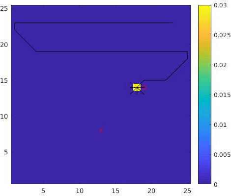
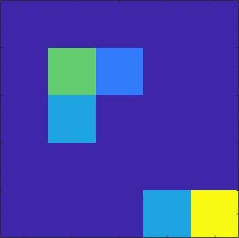
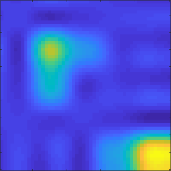
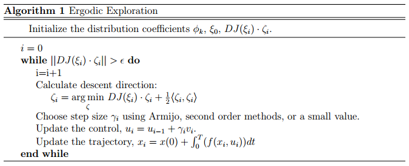
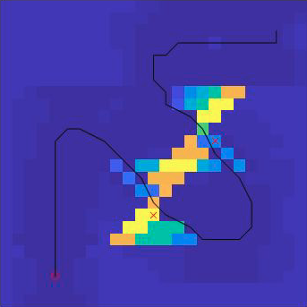
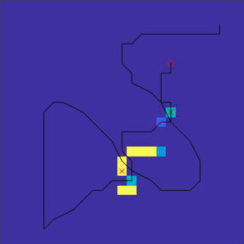
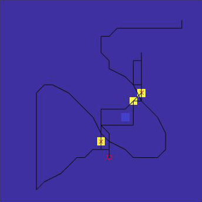
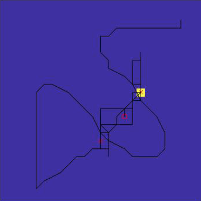

# Ergodic Exploration

For an active sensing problem, I have shown [Infotaxis](https://github.com/yanweiw/infotaxis) is an efficient strategy to locate a target in an unknown environment. However, in cases of multiple targets or distractors, Infotaxis often gets stuck at the first target it comes across and fails to explore the entirety of space. A solution is to use ergodicity as the control signal to optimize. This repo uses ergodic exploration to localize a target in face of a distractor.

# Motivation

The following image shows Infotaxis fails to visit the second door (marked by cross). The reason being that finding a door will concentrate probability to that location, thus any step away from the location will increase entropy. An ergodic trajectory on the other hand will distribute exploration time spatially according to belief distribution and thus demonstrates coverage. In the following, we use the same problem statement in the [Infotaxis repo](https://github.com/yanweiw/infotaxis), but allow one true door and another fake door (with slightly lower detection probability than true door).

Fig 1. Infotaxis gets stuck at first door detected

# Ergodicity

Ergodicity here specifically refers to the ergodicity of a trajectory *X*(t) with respect to a probability distribution &Phi;(x). We define that a trajectory is perfectly **ergodic** with respect to a distribution if the amount of time spent in a neighborhood &Nu; of the state space is proportional to the spatial distribution in the neighborhood &int;N&Phi;(*s*)d*s* . However, *X*(t) and &Phi;(x) live in different domain and to compute a distance metric between them we need to project them onto a common space. The space we choose is Sobolev space and we project *X*(t) to *c*k which is the Fourier coefficients of the spatial statistics of the trajectory, and &Phi;(x) to &phi;k, which is the Fourier coefficients of the spatial distribution, both via multi-dimensional Fourier transform. Because Sobolev space forms a Hilbert space, we can use inner product to specify the distance between *c*k and &phi;k. Consequently, we have a way to quantify how ergodic a trajectory is with respect to the current distribution. The figures below serve as an example how to use Fourier coefficients to represent a distribution. Fig 2 is an example distribution, while Fig 3 is the distribution reconstructed from the Fourier coefficients.

| | |
|-----------------------|--------------------|
|Fig 2. Original distribution | Fig 3. Reconstructed from Fourier representation|

# Ergodic Control

Now we have a **differentiable** distance metric, we can take the directional derivative to do gradient descent to improve the ergodicity of a trajectory. The specific algorithm is attached below. Notice a big difference between this approach and Infotaxis is that Infotaxis chooses the optimal action according to the newly updated distribution at each step, while ergodic control computes a long horizon trajectory and sticks to the same trajectory until finished even as the agent starts to make measurements and update posterior distribution. Once a trajectory is carried out, the agent computes the next optimally ergodic trajectory according to the new distribution. This process is iterated until all goal locations are visited and found.

To produce the following figures, I use iterative Linear Quadratic Regulator (iLQR) to solve for the optimal trajectory. Fig 4 - 7 consist of a sequence of ergodic trajectories. Fig 4 is the first ergodic trajectory based off a uniform prior. The trajectory tries to cover as much space as possible. Once the measurements are made, I compute the second ergodic trajectory using the posterior in Fig 5. The agent goes back to revisit the two likely door locations. Fig 6 shows the agent has pinpointed the two door locations, while Fig 7 shows the agent has found the true door. The slight difference in terms of the probability of detection between the true door and the fake door can be picked up through multiple visits. But it is imperative that the agent should visit both doors at least once, and ergodic control ensures that.

| | |
|-------------------|-------------------|
|Fig 4. First trajectory | Fig 5. Second trajectory|
| | |
|Fig 6. Third trajectory | Fig 7. Fourth trajectory|

### Code

For code, please find my contact at my [portfolio page](https://yanweiw.github.io). Cover image is an ergodic trajectory over a Gaussian distribution.
